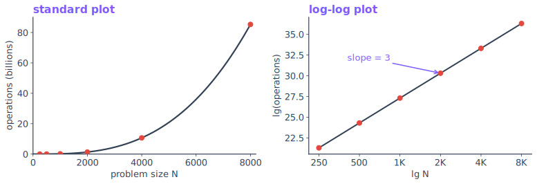
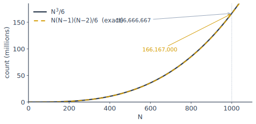
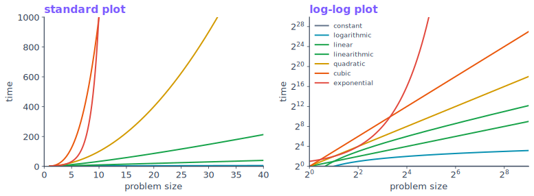
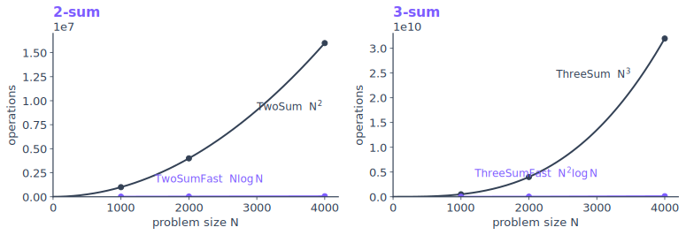

<!--
  CSS 343 · Lecture 1 — Analysis of Algorithms: TIME.
  reveal.js: "---" alone on a line = next part (→), "--" = next slide (↓).
  Speaker notes follow "Note:". Metadata + run instructions live in README.md.
  Follows Sedgewick & Wayne §1.4, adapted to C++. Live demos in demo/, fresh
  graphs in graphs/. Asymptotic notation (O/Θ/Ω) and memory are Lecture 2.

  Session plan (150 min):
    0:00  Part 0  Frame                      (~12 min)
    0:12  Part 1  The problem, a solution    (~25 min)
    0:37  Part 2  Observe: measure it        (~25 min)
    1:02  Part 3  Model: derive it           (~28 min)
    1:30  BREAK                              (10 min)
    1:40  Part 4  Order-of-growth classes    (~20 min)
    2:00  Part 5  Make it faster + big-O     (~25 min)
    2:25  Part 6  Doubling method · wrap     (~5  min)
-->

## CSS 343

### Data Structures, Algorithms & Discrete Mathematics II

**Lecture 1 — Analysis of Algorithms: Time**

<small>Summer 2026 · T/Th 6:00–8:30 · UW1 020 · Dr. Marcel Gavriliu</small>

---

### Part 0 · The course

<small>(~12 min)</small>

--

## What we'll study

- **Data structures** — BSTs & balanced trees, heaps, hash tables, graphs, tries
- **Algorithms** — graph search, shortest paths, spanning trees, greedy, divide & conquer, dynamic programming
- **Analysis** — the time and memory cost of each, start to finish
- **Applications** — regular expressions & finite automata

--

## Week 1: how do we *measure* an algorithm?

Two questions every programmer eventually asks:

- **How long will my program take?** ← today
- **How much memory will it use?** ← Lecture 2

The answers seem to depend on everything — the computer, the input, the program. We can still answer them **scientifically**.

--

## The scientific method, applied to running time

1. **Observe** — measure the running time
2. **Hypothesize** — a model consistent with the data
3. **Predict** — a new running time from the model
4. **Verify** — measure again and compare

Two ground rules: experiments are **reproducible**; hypotheses are **falsifiable**.

--

## Tonight's path

**Problem → Observe → Model → Classify → Improve**

1. Take a concrete problem
2. **Measure** a solution's running time
3. **Derive** the same answer with math
4. Place it among a few **growth rates**
5. Use the analysis to design a **faster** algorithm

---

### Part 1 · A problem, and a first solution

<small>(~25 min)</small>

**Start with the problem — not the code**

--

## The 3-sum problem

> Given *N* integers, how many **triples** sum to exactly **0**?

Input: an array of integers.
Output: the count of unordered triples *(i, j, k)* with `a[i] + a[j] + a[k] == 0`.

**How would you compute this?** Talk to your neighbor for 60 seconds.

--

## A small instance

<div style="font-family:monospace;font-size:1.05em">−40&nbsp;&nbsp;−20&nbsp;&nbsp;−10&nbsp;&nbsp;0&nbsp;&nbsp;5&nbsp;&nbsp;10&nbsp;&nbsp;30&nbsp;&nbsp;40</div>

Four triples sum to zero:

- (−40, 10, 30)  (−40, 0, 40)
- (−20, −10, 30)  (−10, 0, 10)

So for this input the answer is **4**.

--

## Is 3-sum a "real" problem?

**As stated, it's a toy** — a clean problem to practice analysis on.

But the pattern is real:

- **Computational geometry** — testing whether any 3 of *N* points are collinear reduces to 3-sum.
- 3-sum is the textbook example of a problem with **no known sub-quadratic algorithm** — a genuine open question.

--

## How would you implement it?

The direct idea: **enumerate every triple** *i < j < k* and test the sum.

- one loop picks *i*
- a nested loop picks *j > i*
- a third picks *k > j*
- test `a[i] + a[j] + a[k] == 0`

The constraint *i < j < k* counts each triple **once**.

--

## Brute force: check every triple

```cpp
long count3(const vector<int>& a) {
    int N = a.size();
    long cnt = 0;
    for (int i = 0;   i < N; i++)
      for (int j = i+1; j < N; j++)
        for (int k = j+1; k < N; k++)
          if (a[i] + a[j] + a[k] == 0)
              cnt++;
    return cnt;
}
```

Correct and obvious. **Now: how expensive is it?**

--

## What is a "basic operation"?

We count a representative repeated operation, not wall-clock time.

For `count3`, the work is dominated by the **inner loop body** — it runs once per triple tested.

> **One tick per inner-loop execution** — one per triple. (Each does 3 array accesses `a[i]`,`a[j]`,`a[k]`, so accesses are just **3×** — same order.)

--

## Cost depends on N, not the values

Run `count3` on different inputs of the **same size** N: the running time barely changes.

- The loops execute the same number of times regardless of *which* integers.
- Only the **problem size** N drives the cost.

So we ask one question: **how does running time grow with N?**

---

### Part 2 · Observe — measure it

<small>(~25 min)</small>

**The experiment**

--

## Live: run it, doubling N

```
$ g++ -std=c++17 -O2 demo/threesum.cpp -o threesum
$ ./threesum
```

Each step **doubles N** and prints the operation count and its **ratio** to the previous line.

--

## What we observe

```
     N   triples     operations   ratio   time(s)
   250         0        2573000      –     0.002
   500         8       20708500    8.05    0.012
  1000        62      166167000    8.02    0.077
  2000       512     1331334000    8.01    0.528
```

The **operation-count ratio → 8** every time N doubles.

--

## Reading the ratio

When N **doubles**, operations go up by **~8 = 2³**.

- ×2 each doubling ⇒ linear
- ×4 each doubling ⇒ quadratic
- **×8 each doubling ⇒ cubic**

The ratio is the exponent in disguise. Hold that thought — we'll make it exact.

--

## Plot the data



Left: the raw curve. Right: the **log-log plot — a straight line of slope 3**.

--

## Why a log-log plot?

Take logs of a power law $T(N) = aN^{b}$:

$$\lg T(N) = b\lg N + \lg a$$

That's a **straight line** in $(\lg N,\ \lg T)$ with **slope = b**.

So: plot log-log, measure the slope, read off the exponent.

--

## The power law

Slope **b = 3**, so $T(N) = aN^{3}$. Solve for *a* from one measured point, then **predict**:

- T(4000) ≈ 8 × T(2000)
- T(8000) ≈ 8 × T(4000)

A back-of-the-envelope forecast, before the run finishes.

--

## Predict, then verify

We measured small N, fit $T = a N^3$, and forecast large N.

- Forecast stands or falls on the **next measurement**.
- Agreement raises confidence; one miss kills the model.

But measuring doesn't tell us **why** the exponent is 3. For that, we model.

---

### Part 3 · Model — derive it

<small>(~28 min)</small>

**Why N³? Get it from the code, not the stopwatch**

--

## Knuth's insight

$$\text{total time} = \sum_{\text{statements}} (\text{cost}) \times (\text{frequency})$$

- **cost** of one statement — a property of the machine/compiler
- **frequency** — how often it runs, a property of the algorithm and input

The hard, interesting part is always **frequency**.

--

## How often does the inner `if` run?

Once per triple *i < j < k* — the number of ways to choose **3 of N**:

$$\binom{N}{3} = \frac{N(N-1)(N-2)}{6}$$

This is a **counting** problem — combinations, straight from discrete math.

--

## Expand it

$$\binom{N}{3} = \frac{N^3}{6} - \frac{N^2}{2} + \frac{N}{3}$$

At **N = 1000**:

$$\tfrac{10^9}{6} - \tfrac{10^6}{2} + \tfrac{1000}{3} = 166{,}167{,}000$$

— **exactly** the count the live demo printed.

--

## Tilde: drop the small terms

At N = 1000 the $-\tfrac{N^2}{2}+\tfrac{N}{3}$ terms ≈ −499,667 — tiny beside $\tfrac{N^3}{6}\approx 1.667\times10^{8}$:



$$\frac{N(N-1)(N-2)}{6} \sim \frac{N^3}{6}$$

--

## Why dropping them is legitimate

$$\frac{N^3/6 - N^2/2 + N/3}{N^3/6} = 1 - \frac{3}{N} + \frac{2}{N^2} \longrightarrow 1$$

as N → ∞. The correction shrinks as N grows. **Tilde keeps the leading term**; everything else is noise at scale.

--

## Order of growth

Drop the constant too — keep only the **shape**:

| exact frequency | tilde | **order of growth** |
|---|---|---|
| N(N−1)(N−2)/6 | ~N³/6 | **N³** |
| N²/2 − N/2 | ~N²/2 | **N²** |
| lg N + 1 | ~lg N | **lg N** |

The order of growth is the function of N the cost is **proportional to**.

--

## Cost model → a proposition

Counting **array accesses** with the inner loop:

> **Proposition.** Brute-force 3-sum makes **~N³/2** array accesses.
>
> Three accesses (`a[i]`, `a[j]`, `a[k]`) for each of ~N³/6 triples.

A cost model lets us state a fact about the **algorithm**, not one implementation.

--

## Model meets experiment

| | result |
|---|---|
| **Math model** | ~N³/6 triples ⇒ ~N³/2 array accesses |
| **Experiment** | log-log slope 3, ratio → 8 |
| **Both** | **order of growth = N³** |

> **Property A.** The order of growth of 3-sum's running time is **N³**.

--

## Separating algorithm from machine

The order of growth **N³** does *not* depend on:

- the language (C++ / Java / Python)
- the machine (laptop / phone / server)

It depends on the **algorithm** — it examines all triples. That's why analysis from decades ago still applies.

---

## ☕ Break

<small>(10 min)</small>

When we return: the handful of growth rates you'll see all term, then how to beat N³.

---

### Part 4 · Order-of-growth classes

<small>(~20 min)</small>

--

## The few that matter

| order | name | C++ shape | example |
|---|---|---|---|
| 1 | constant | a statement | add two numbers |
| log N | logarithmic | halve each step | binary search |
| N | linear | one loop | find the max |
| N log N | linearithmic | divide & conquer | mergesort |
| N² | quadratic | double loop | check all pairs |
| N³ | cubic | triple loop | 3-sum |
| 2ⁿ | exponential | all subsets | exhaustive search |

--

## Where each shape comes from

- **constant** — work that doesn't loop over the input
- **logarithmic** — each step throws away a constant fraction (binary search halves)
- **linear** — touch each element a constant number of times
- **linearithmic** — split in half, recurse, combine (mergesort)

--

## …and the expensive ones

- **quadratic** — every pair: a loop inside a loop (N²)
- **cubic** — every triple: three nested loops (N³ — tonight's 3-sum)
- **exponential** — every subset: 2ⁿ, infeasible beyond tiny N

Nesting **multiplies**; that's why exponents climb so fast.

--

## Why the exponent rules everything



Log-log turns each class into a **line whose slope is its exponent.**

--

## What it means in seconds

At **N = 10⁶**, on a 10⁹ ops/sec machine:

| growth | time |
|---|---|
| N | 1 ms |
| N log N | 20 ms |
| N² | ~17 minutes |
| N³ | ~31 years |
| 2ⁿ | beyond the age of the universe |

Same machine, same language — the **algorithm** decides feasibility.

--

## The takeaway

Order of growth — **not constant factors, not the machine** — decides whether a program finishes.

So when a program is too slow, the first question is not "faster machine?" but **"better order of growth?"**

---

### Part 5 · Designing a faster algorithm

<small>(~25 min)</small>

**Analysis guides design**

--

## Can cubic be beaten?

3-sum is N³. **Is that the best possible — or can we do better?**

Most first reactions: "you have to check every triple, so no."

Let's see whether that's true. First, a smaller version of the problem.

--

## Warm-up: 2-sum, brute force

Count **pairs** that sum to 0 — a double loop:

```cpp
long twoSum(const vector<int>& a) {        // ~ N^2
    int N = a.size(); long cnt = 0;
    for (int i = 0;   i < N; i++)
      for (int j = i+1; j < N; j++)
        if (a[i] + a[j] == 0) cnt++;
    return cnt;
}
```

Order of growth **N²**.

--

## How could 2-sum be faster?

Reframe the inner loop. For each `a[i]`, it's really asking:

> Is **−a[i]** somewhere in the array?

A linear scan answers that in N steps. But if the array were **sorted**, we could answer it in **log N** with binary search.

--

## 2-sum, fast

**Sort once**, then **binary-search** for each `−a[i]`:

```cpp
long twoSumFast(vector<int> a) {           // ~ N log N
    sort(a.begin(), a.end());              // N log N  (preprocess)
    int N = a.size(); long cnt = 0;
    for (int i = 0; i < N; i++)            // N searches ...
      if (rankOf(-a[i], a) > i) cnt++;     // ... × log N each
    return cnt;
}
```

`rankOf(x, a)` = binary search: how many elements of sorted `a` are `< x`. The `> i` test skips self-pairs and avoids double-counting.

--

## Big-O arithmetic I — the sum rule

Do step **A**, then step **B** ⇒ the costs **add**, and the **larger dominates**.

Sort *(N log N)* **then** N searches *(N log N each)*:

$$N\log N + N\log N = 2N\log N \Rightarrow N\log N$$

Drop the constant 2. A sort followed by N searches is **linearithmic**, not quadratic.

--

## Big-O arithmetic II — the sum rule, unequal terms

When the terms differ, **only the biggest survives**:

| sum | order of growth |
|---|---|
| N + N² | **N²** |
| N log N + N² | **N²** |
| N log N + N | **N log N** |
| N² + 100 N + 5000 | **N²** |

A cheaper preprocessing step is "free" next to a more expensive main loop.

--

## Big-O arithmetic III — the product rule

**Nested** work **multiplies** — outer iterations × work per iteration:

$$N \times \log N = N\log N$$

$$N^2 \times \log N = N^2\log N$$

A loop of N iterations doing log N work each is N log N — **not** N + log N.

--

## The preprocessing trade

We **added** a sort (N log N) to **remove** a loop:

| | 2-sum |
|---|---|
| brute force | N² |
| sort + binary search | **N log N** |

Spend a little up front (preprocess) so each lookup is cheap. **Now lift the idea to 3-sum.**

--

## Same idea → fast 3-sum

Sort, then for each **pair** binary-search for `−(a[i]+a[j])`:

```cpp
long threeSumFast(vector<int> a) {         // ~ N^2 log N
    sort(a.begin(), a.end());              // N log N  (preprocess)
    int N = a.size(); long cnt = 0;
    for (int i = 0;   i < N; i++)
      for (int j = i+1; j < N; j++)
        if (rankOf(-a[i]-a[j], a) > j) cnt++;
    return cnt;
}
```

By the rules: N log N **+** N²·log N **=** **N² log N** — down from N³.

--

## Live: see the gap

```
$ g++ -std=c++17 -O2 demo/faster.cpp -o faster && ./faster
```



The fast versions hug the axis; the brute-force versions explode.

--

## How fast *can* we go?

A **lower bound** is the best order of growth *any* algorithm could achieve.

- 2-sum: no algorithm beats N log N (comparison model)
- 3-sum: nobody has proven a sub-quadratic algorithm — believed to be ~N²

A lower bound tells you when to **stop** optimizing.

---

### Part 6 · The shortcut & what's next

<small>(~5 min)</small>

--

## The doubling-ratio method

The fastest way to find an algorithm's order of growth:

1. Run it, **doubling N**; record the ratio of consecutive running times.
2. Ratio → **2ᵇ** ⇒ order of growth **Nᵇ**.

We saw **ratio → 8 = 2³** ⇒ N³.

Two minutes of doubling gives the exponent — and tells you whether the algorithm can ride Moore's Law.

--

## Moore's Law: who keeps up?

Hardware doubles speed (**2× faster**) every ~2 years. In the same wall-clock time, what bigger problem can you now solve?

For an **Nᵇ** algorithm, a 2× machine grows feasible N by **2^(1/b)**:

| order | ratio (N doubles) | one 2× machine grows N by |
|---|---|---|
| N — linear | 2 | **×2** (doubles!) |
| N² — quadratic | 4 | ×√2 ≈ 1.41 |
| N³ — cubic | 8 | ×∛2 ≈ 1.26 |
| 2ⁿ — exponential | — | **+1 element** |

--

## To *double* the problem

Run the trade the other way: to solve **2N** in the same time you need a **2ᵇ×** machine — exactly **b Moore's-Law generations** (~2 yr each).

| order | speedup to double N | wait |
|---|---|---|
| N — linear | 2× | ~2 yr |
| N² — quadratic | 4× | ~4 yr |
| N³ — cubic | 8× | ~6 yr |
| 2ⁿ — exponential | impossible | never |

The doubling ratio **2ᵇ** is the whole story: **b** is how many hardware generations it costs to double your input. Only linear (or better) keeps pace; cubic and up fall behind, and exponential never starts.

--

## ICA 01 — your turn

In `ica01/`: instrument **3-sum** and run the **doubling experiment**.

1. Add a counter to `count3`; print N, operations, ratio (skeleton provided)
2. Confirm the ratio → **8**; predict operations at N = 16000
3. One sentence: what order of growth, and how the ratio shows it

**Start now, finish at home.** Submit `threesum_lab.cpp` before Session 2.

