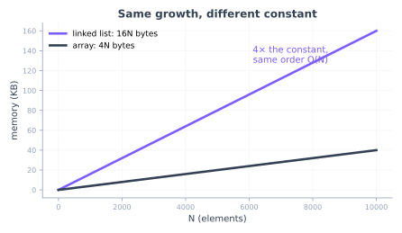
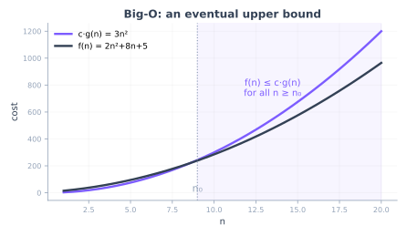
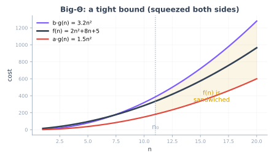

<!--
  CSS 343 · Lecture 2 — Space Complexity + Asymptotic Notation.
  reveal.js: "---" = next part (→), "--" = next slide (↓). Notes follow "Note:".
  Concrete C++ (sizeof, structs, stack/heap) — no templates/inheritance.
  KaTeX gotcha: never put two "_" on one line (use a/b, not c_1/c_2); a single
  n_0 per line is fine. Live demo in demo/, graphs in graphs/.

  Session plan (150 min):
    0:00  Part 0  Frame                         (~10 min)
    0:10  Part 1  Counting memory in C++        (~28 min)
    0:38  Part 2  Memory as a function of N     (~22 min)
    1:00  BREAK                                 (10 min)
    1:10  Part 3  Why we need precise notation  (~8  min)
    1:18  Part 4  Big-O (upper bound)           (~25 min)
    1:43  Part 5  Big-Ω and Big-Θ               (~25 min)
    2:08  Part 6  Using the notation            (~16 min)   [+ BFS-memory case study: when O/Θ/Ω differ]
    2:24  Part 7  Wrap & ICA 02                 (~6  min)
-->

## CSS 343

### Data Structures, Algorithms & Discrete Mathematics II

**Lecture 2 — Space Complexity & Asymptotic Notation**

<small>Summer 2026 · T/Th 6:00–8:30 · UW1 020 · Dr. Marcel Gavriliu</small>

---

## Reading

**Sedgewick & Wayne, *Algorithms* (4th ed.) — §1.4, "Analysis of Algorithms"**

The common source for **all of Week 1**:

- **L01 (time)** — empirical timing, the doubling method, tilde & order of growth
- **L02 (space)** — memory cost, and order of growth applied to space

Read it alongside both lectures.

---

### Part 0 · Frame

<small>(~10 min)</small>

--

## Last time: time

We measured and modeled **running time**:

- counted a basic operation (3-sum: ~N³/6 triples)
- **order of growth** — drop constants and lower-order terms
- the doubling experiment: ratio → 2ᵇ ⇒ Nᵇ

We wrote "**~N³**" and "**order of growth N³**" — useful, but informal.

--

## Tonight

Two things:

1. **Space complexity** — count the bytes a structure uses, then how that grows with N (its **order of growth**) — in concrete C++.
2. **Asymptotic notation** — Big-O, Big-Θ, Big-Ω: the precise definitions behind "order of growth," and what they pin down about an **algorithm** versus a **problem**.

One rigorous, shared language for every cost — time or space — from here on.

---

### Part 1 · Counting memory in C++

<small>(~28 min)</small>

**How many bytes?**

--

## The question

A data structure occupies memory. **How much?**

To answer it we need to know the size of its pieces — starting with the primitive types.

**How many bytes is an `int`? a pointer? a `double`?**

--

## `sizeof`: the primitive types

On a typical 64-bit machine:

| type | bytes | | type | bytes |
|------|:----:|--|------|:----:|
| `char` | 1 | | `long` | 8 |
| `bool` | 1 | | `double` | 8 |
| `int` | 4 | | **pointer** | **8** |

`sizeof(x)` returns the size in bytes — a compile-time fact.

--

## Predict: how big is this node?

```cpp
struct Node {
    int   data;
    Node* next;
};
```

Recall the byte sizes from the table. **Vote: `sizeof(Node) == 12` or `== 16`?**

--

## Alignment & padding

`sizeof(Node)` is **16**, not 12.

<div style="font-family:monospace;font-size:1.05em;letter-spacing:.05em">[ data : 4 ][ pad : 4 ][ next : 8 ]</div>

The 8-byte pointer must sit at an 8-byte boundary, so the compiler inserts **4 bytes of padding** after `data`. Total: 16.

--

## Field order changes the size

Same three fields, two orders:

```cpp
struct A { char a; int b; char c; };   // 12 bytes
struct B { int b; char a; char c; };   //  8 bytes
```

`A` pads after `a` (to 4-align `b`) **and** after `c`; `B` lets the two `char`s share the tail — no interior padding.

**Order fields large → small to shrink padding** — here a free **33%**.

--

## Live: `sizeof_demo.cpp`

```
$ g++ -std=c++17 -O2 demo/sizeof_demo.cpp -o sizeof_demo && ./sizeof_demo
```

Prints the primitive sizes, `sizeof(Node) = 16` (padding), and the **measured** heap cost of a real array vs a real linked list of N ints.

--

## Where the bytes live: stack vs heap

```cpp
Node  a;              // on the STACK (automatic; freed at scope end)
Node* p = new Node;   // the node is on the HEAP (you free it: delete p)
```

- **Stack** — local variables; fast; freed automatically at scope exit.
- **Heap** — `new` / `delete`; lives until you free it; where dynamic structures grow.

--

## Each node carries overhead

A linked-list node stores **one int of data** but costs **16 bytes**:

- 4 bytes of actual data
- 4 bytes padding + 8 bytes pointer = **12 bytes of overhead**

The structure you choose has a memory price, not just a time price.

---

### Part 2 · Memory as a function of N

<small>(~22 min)</small>

**Space has an order of growth too**

--

## How much memory for N elements?

Two ways to hold N integers:

- an **array** — `int a[N];` (contiguous)
- a **linked list** — N `Node`s

**Which uses more memory, and how does each grow with N?**

--

## Array vs linked list

| structure | bytes for N ints | order |
|-----------|:----------------:|:-----:|
| array | 4N | **O(N)** |
| linked list | 16N | **O(N)** |



Same **order of growth** — different **constant** (4×).

--

## Order of growth, for space

The same vocabulary as time:

| structure | memory | order |
|-----------|--------|:-----:|
| one variable | constant | O(1) |
| array / list of N | proportional to N | O(N) |
| N × N matrix (adjacency) | proportional to N² | O(N²) |

**Space** is analyzed exactly like **time** — count, then keep the order of growth.

--

## Auxiliary space — what an *algorithm* adds

We analyze **auxiliary space**: the memory an algorithm uses **beyond its input**.

**O(1) — constant extra space.** A few variables, no allocation:

```cpp
long sum(const vector<int>& a) {
    long s = 0;               // one accumulator
    for (int x : a) s += x;   // nothing allocated
    return s;
}
```

Last time's brute-force 3-sum is **O(N³) time but O(1) extra space** — just loop counters.

--

## O(N) space: mergesort

**Problem:** put N items in sorted order.

**Approach** — divide & conquer:

1. split the array into two halves
2. recursively sort each half
3. **merge** the two sorted halves into one

Splitting is free; **merging** needs scratch space — that's the memory.

--

## Mergesort — the code

```cpp [2]
void merge(vector<int>& a, int lo, int mid, int hi) {
    vector<int> tmp(hi - lo + 1);                 // O(N) scratch buffer
    int i = lo, j = mid + 1, k = 0;
    while (i <= mid && j <= hi)
        tmp[k++] = (a[i] <= a[j]) ? a[i++] : a[j++];
    while (i <= mid) tmp[k++] = a[i++];
    while (j <= hi)  tmp[k++] = a[j++];
    for (k = 0; k < (int)tmp.size(); k++) a[lo+k] = tmp[k];
}
void mergesort(vector<int>& a, int lo, int hi) {
    if (lo >= hi) return;                         // base case: 1 element
    int mid = (lo + hi) / 2;
    mergesort(a, lo, mid);  mergesort(a, mid+1, hi);
    merge(a, lo, mid, hi);
}
```

The highlighted **`tmp`** is the **O(N)** space; recursion adds O(log N) stack. (`demo/mergesort.cpp`)

--

## Mergesort — watch the memory

<div class="algo-viz" data-algo="mergesort">
<div class="viz-panels">
<div class="panel"><div class="panel-label">progress — sorting the array</div><canvas class="viz-progress"></canvas></div>
<div class="panel"><div class="panel-label">memory — auxiliary bytes</div><canvas class="viz-memory"></canvas></div>
</div>
<div class="viz-controls">
<button data-act="play">▶ Play</button>
<button data-act="step">Step</button>
<button data-act="reset">Reset</button>
<span class="viz-status"></span>
</div>
</div>

--

## O(n²) space: grid BFS

**Problem:** from a start cell, explore an **n×n grid** — flood-fill a region, or find shortest paths.

**Approach** — breadth-first, expand in waves:

1. a **queue** holds the current frontier
2. pop a cell, **mark it visited**, push its unvisited neighbors
3. repeat until the queue is empty

The **visited** grid is where the memory goes.

--

## Grid BFS — the code

```cpp [2-3]
void bfs(int n) {
    vector<vector<char>> visited(n, vector<char>(n, 0));  // n² cells, 1 byte each
    queue<pair<int,int>> frontier;                        // the frontier
    frontier.push({0,0});  visited[0][0] = 1;
    int dr[4]={-1,1,0,0}, dc[4]={0,0,-1,1};              // 4 neighbors
    while (!frontier.empty()) {
        auto [r,c] = frontier.front();  frontier.pop();
        for (int d = 0; d < 4; d++) {
            int nr=r+dr[d], nc=c+dc[d];
            if (nr>=0&&nr<n&&nc>=0&&nc<n&&!visited[nr][nc]) {
                visited[nr][nc]=1;  frontier.push({nr,nc});
            }
        }
    }
}
```

The **visited** grid (n²) dominates; the queue is only the O(n) wavefront. (`demo/bfs_grid.cpp`)

--

## What the n² stores

Store more per cell, pay a bigger constant — all still **Θ(n²)**:

| stored per cell | bytes | total | buys you |
|---|:---:|:---:|---|
| visited flag (`char`) | 1 | n² | reachable? |
| distance (`int`) | 4 | 4n² | hops to each cell |
| predecessor id (`int`) | 4 | 4n² | the path |
| came-from dir (`char`) | 1 | n² | the path, 4× cheaper |

**The constant tracks what you store** — a `char` *distance* overflows (paths reach ~n²).

--

## Grid BFS — watch the memory

<div class="algo-viz" data-algo="bfs">
<div class="viz-panels">
<div class="panel"><div class="panel-label">progress — BFS through a maze (start → goal)</div><canvas class="viz-progress"></canvas></div>
<div class="panel"><div class="panel-label">memory — visited array (n²) vs queue</div><canvas class="viz-memory"></canvas></div>
</div>
<div class="viz-controls">
<button data-act="play">▶ Play</button>
<button data-act="step">Step</button>
<button data-act="reset">Reset</button>
<span class="viz-status"></span>
</div>
</div>

Nuance if a student asks "do we even need the visited array?": not strictly, for *distance/reachability*. BFS edges only span adjacent layers, so keeping just the previous + current frontier is enough to avoid revisiting — that's Korf's **frontier search**, O(frontier) memory (≈ O(n) on a grid). Catches: it gives the distance, not the path (the path needs predecessors, O(n²) again), and a general graph's frontier can itself be O(V). So for shortest-path BFS as written, O(n²) stands.

--

## Time and space are independent

| algorithm | time | extra space |
|-----------|:----:|:-----------:|
| array sum | Θ(N) | Θ(1) |
| brute-force 3-sum | Θ(N³) | **Θ(1)** |
| mergesort | Θ(N log N) | Θ(N) |
| BFS on n×n grid | Θ(n²) | Θ(n²) |
| DP table over all 2^N subsets | Θ(2^N · N) | **Θ(2^N)** |

--

## Space–time tradeoffs

Often you can **spend memory to save time** — or the reverse:

- a **hash table** uses extra space for O(1) lookups (Session 7)
- **dynamic programming** stores subproblem answers to avoid recomputing (Sessions 14–15)
- a smaller, slower encoding saves space at the cost of time

--

## Constants matter in practice

Order of growth decides feasibility **at scale**. But for memory the **constant** often decides real performance:

- contiguous array → cache-friendly, few misses
- pointer-chasing list → a cache miss per hop

Same O(N), very different wall-clock — the constant is the cache behavior.

---

## ☕ Break

<small>(10 min)</small>

When we return: making "order of growth" mathematically precise.

---

### Part 3 · Why we need precise notation

<small>(~8 min)</small>

--

## "~N³" was informal

We've leaned on loose phrases: "**about** N³," "**order of growth** N³," "grows **like** N²."

To compare algorithms and state guarantees we need definitions that:

- ignore machine-dependent **constants**
- ignore behavior at **small n**
- say exactly what "grows like" **means**

--

## The idea

Classify functions by **how they grow** for large n, ignoring constant factors.

Three relationships:

- **Big-O** — grows **no faster than** (upper bound)
- **Big-Ω** — grows **no slower than** (lower bound)
- **Big-Θ** — grows **at the same rate** (tight bound)

---

### Part 4 · Big-O — the upper bound

<small>(~25 min)</small>

--

## Definition: Big-O

$$f(n) = O(g(n))$$

means there exist constants $c > 0$ and $n_0 > 0$ such that

$$0 \le f(n) \le c \cdot g(n) \quad \text{for all } n \ge n_0$$

Beyond some point n₀, $f$ stays **below a constant multiple** of $g$.

--

## The picture



Pick c so that **c·g(n)** sits above **f(n)** for all **n ≥ n₀**.

--

## Worked example

Claim: $2n^2 + 8n + 5 = O(n^2)$.

Find $c$ and $n_0$. For $n \ge 1$:

$$2n^2 + 8n + 5 \le 2n^2 + 8n^2 + 5n^2 = 15n^2$$

So $c = 15$, $n_0 = 1$ works. (A tighter $c$ like 3 works for larger $n_0$.)

--

## What Big-O really says

- an **upper bound** — "no worse than," up to a constant
- only for **large n** (≥ n₀)
- constants and lower-order terms **vanish**

$$3n^2 + 100n \;=\; O(n^2) \qquad 5n \;=\; O(n^2)$$

--

## Big-O arithmetic (recap from L01)

Inside O(·), keep the dominant term:

- **drop constants:** O(5n) = O(n)
- **drop lower-order terms:** O(n² + n) = O(n²)
- **sum (sequential):** O(n) + O(n²) = O(n²)
- **product (nested):** O(n) · O(log n) = O(n log n)

--

## Pitfall: O is not "the running time"

"The running time **is** O(n²)" only says it's **at most** ~n².

- it could actually be linear
- O alone gives **no lower bound**

To say an algorithm's cost grows *exactly* like n², we need a second tool.

---

### Part 5 · Big-Ω and Big-Θ

<small>(~25 min)</small>

--

## Big-Ω — the lower bound

$$f(n) = \Omega(g(n))$$

means there exist constants $c > 0$ and $n_0 > 0$ such that

$$f(n) \ge c \cdot g(n) \quad \text{for all } n \ge n_0$$

$f$ grows **at least as fast** as $g$ — a floor instead of a ceiling.

--

## Big-Θ — the tight bound

$$f(n) = \Theta(g(n))$$

means $f$ is **both** $O(g(n))$ **and** $\Omega(g(n))$: there are constants $a, b > 0$ with

$$a \cdot g(n) \le f(n) \le b \cdot g(n) \quad \text{for all } n \ge n_0$$

$f$ is **squeezed** between two constant multiples of $g$.

--

## The sandwich



**a·g(n) ≤ f(n) ≤ b·g(n)** — f trapped between two multiples of g.

--

## O, Ω, Θ together

| notation | bound | reads as |
|----------|-------|----------|
| O(g) | upper | "grows no faster than g" |
| Ω(g) | lower | "grows no slower than g" |
| Θ(g) | tight | "grows at the same rate as g" |

**Θ = O and Ω at the same g.**

--

## "Order of growth" = Θ

Last time's results, stated precisely:

- brute-force 3-sum: **Θ(N³)**
- fast 3-sum: **Θ(N² log N)**
- an array / linked list of N: **Θ(N)** space

The doubling experiment estimates the **Θ** exponent empirically.

--

## Worked: 2n² + 8n + 5 = Θ(n²)

- **O(n²):** ≤ 15n² for n ≥ 1 ✓ (shown earlier)
- **Ω(n²):** ≥ 2n² for n ≥ 1 (the leading term alone) ✓

Both bounds use **n²**, so it's **Θ(n²)**.

--

## The function hierarchy

For large n, each grows strictly faster than the one before:

$$1 < \log n < \sqrt{n} < n < n\log n < n^2 < n^3 < 2^n < n!$$

Lower in the list = cheaper. We design toward the left.

---

### Part 6 · Using the notation

<small>(~16 min)</small>

--

## Case ≠ bound

A frequent confusion. **Two independent choices:**

- **which input** — best / worst / average case
- **which bound** — O / Ω / Θ

You can put **any bound** on **any case**. "Worst case is O(n²)" picks one of each.

--

## Example: search

| | best | worst |
|--|------|-------|
| **linear search** | Θ(1) (first element) | Θ(n) |
| **binary search** (sorted) | Θ(1) (middle) | Θ(log n) |

When people say "binary search is O(log n)" they mean its **worst case** is Θ(log n).

--

## Reading analysis carefully

- "**O(n log n)**" — an upper bound; often people mean it's **tight** (Θ)
- "**worst case Θ(n²)**" — the slowest input costs exactly ~n²
- "**Ω(n)**" — can't be faster than linear (e.g. must read all input)

When precision matters, name the **case** and the **bound**.

--

## A case study: BFS memory

How much memory does **BFS on an n×n grid** use? It depends on how you store *visited*:

| `visited` structure | space |
|---|---|
| a fixed n×n array | **Θ(n²)** — same for every maze |
| a dynamic tree / set (a node per reached cell) | **Θ(R)**, R = cells reached |

For the dynamic one, **R depends on the maze**: from **1** (start walled in) to **n²** (open grid). A single corridor across the grid → R ≈ n → **Θ(n)**.

--

## Which bound, and when?

Space is **Θ(R)** in the cells reached (output-sensitive). But **as a function of n** there's **no single Θ**:

best **Θ(1)** · worst **Θ(n²)** · across all inputs, only **O(n²)**

- **Θ** = a *tight* cost (input-insensitive, or one named case)
- **O** = an *upper bound* — for input-*sensitive* costs
- **Ω** = a *lower bound* — "can't do better"

--

## Whose property is a bound?

Everything we've pinned belongs to a specific algorithm:

- brute-force 3-sum — **Θ(N³)**
- fast 3-sum — **Θ(N² log N)**
- mergesort — **Θ(N log N)**

1. Are these **O / Θ / Ω** properties of the **problem**, or of the **algorithm**?
2. If not the problem — what *can* we say about the problem itself?

Talk to your neighbor — 60 seconds.

--

## A bound is the algorithm's

About the *problem* a Θ says only an **upper bound** — "no harder than this" — and a better algorithm **lowers** it:

- brute force ⇒ O(N³)
- sort + binary search ⇒ O(N² log N)
- two pointers (L01) ⇒ **O(N²)** — best known

A *witness*: the cost is **achievable**, never proven **required**.

--

## What's true of the problem?

A **lower bound (Ω)** *is* the problem's own property — **no algorithm can beat it**. It's **pinned to Θ** only when an algorithm (upper) **meets** a proof (lower):

| problem | best algorithm | proven floor | |
|---|:---:|:---:|---|
| sorting | O(N log N) | Ω(N log N) | **Θ — solved** |
| 3-sum | O(N²) | Ω(N) | **gap — open** |

The gap is an **open question**: is sub-quadratic 3-sum possible?

---

### Part 7 · Wrap & ICA 02

<small>(~6 min)</small>

--

## Recap

**Memory:** count bytes — `sizeof`, padding, stack vs heap. Space has an order of growth (array vs list: same Θ(N), 4× constant).

**Notation:** O (upper), Ω (lower), Θ (tight) make "order of growth" precise — for large n, up to constants.

--

## ICA 02 — your turn

The doubling experiment, for **time *and* memory**, on **two algorithms** (`ica02/`):

1. **Instrument** the two `*_lab.cpp` files — add an op-counter + peak-memory tracker (`TODO`s)
2. **Run** → `mergesort.csv`, `grid.csv`
3. **Plot** with `plot.py` → `graphs.png` + the doubling ratios
4. **Quiz:** enter the ratios, pick the big-Os, **upload the zip**

