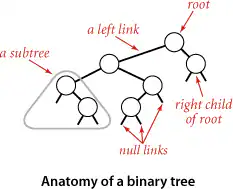
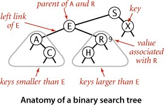
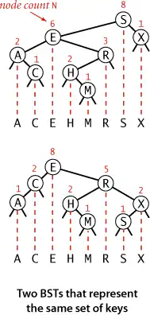
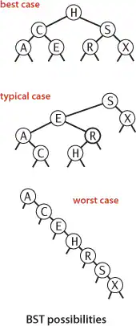
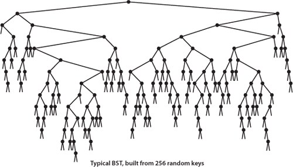

<!--
  CSS 343 · Lecture 3 (Session 3) — Trees & Binary Search Trees.
  reveal.js: "---" = next part (→), "--" = next slide (↓). Notes follow "Note:".
  Concrete C++ (structs, pointers, new/delete) — no templates/inheritance.
  KaTeX gotcha: never put two "_" on one line (use a/b, not c_1/c_2). Verify
  every slide at 1280×620 before shipping.

  Reading (pre): Sedgewick §3.2 (Binary Search Trees) — primary; ODS Ch 6–7 secondary.
  Reading quiz: quiz/reading-quiz-s3-trees-bst — due before class.

  COVERAGE. Superset of BOTH sources:
   • SP26 "1.-Tree": general trees, binary trees, full/perfect/complete/balanced,
     heights, array implementation, traversals, EXPRESSION TREES (+ postfix eval), BST.
   • Sedgewick §3.2: BST as a SYMBOL TABLE (key→value + subtree COUNT field); search
     hit/miss + the path; insert with link/count reset on the way up; the construction
     trace; ORDERED OPS (min/max, floor/ceiling, select/rank, deleteMin/Max, range
     queries); HIBBARD deletion (successor); analysis — dual-to-quicksort, internal
     path length, Prop C (hits ~1.39 log₂ N), Prop D (miss/insert ~1.39 log₂ N), Prop E
     (ops ∝ height), average HEIGHT ~2.99 log₂ N (≠ path length), cost summary.
  Huffman (SP26 bundled it here) → relocated to S16 (greedy); not covered in this deck.

  INTERACTIVE DEMOS — EVERY Sedgewick/SP26 figure becomes a demo (build under viz/,
  load in index.html, init in Reveal.initialize(...).then(...) like L02). Each is on
  its OWN slide. data-algo ids:
    D1 tree-terms · D2 general-tree · D3 tree-shapes · D4 tree-height · D5 array-tree
    D6 traversals · D7 expr-tree · D8 bst-ops (anatomy/search/insert/trace/delete)
    D9 bst-shape (best/typical/worst, internal path length) · D10 bst-ordered
    (min/max, floor/ceiling, select/rank, range) · D11 bst-experiments (compares vs N)

  Session plan (150 min, 6:00–8:30). Part 0/Frame removed — dive straight into content.
    0:00  Intro (title + reading)          ~3 min
    0:03  Part 1  Trees & terminology       14 min
    0:17  Part 2  Binary trees              19 min
    0:36  Part 3  Traversals                10 min
    0:46  Part 4  Expression trees           8 min
    0:54  Part 5  BST as a symbol table      8 min
    1:02  ☕ BREAK                          10 min
    1:12  Part 6  Search & insert           16 min
    1:28  Part 7  Ordered operations        17 min
    1:45  Part 8  Deletion                  16 min
    2:01  Part 9  Analysis                  20 min   (incl. the ancestor-probability proof)
    2:21  Part 10 BST applications           4 min
    2:25  Part 11 Wrap & ICA 03              5 min
    2:30  end
-->

## CSS 343

### Data Structures, Algorithms & Discrete Mathematics II

**Lecture 3 — Trees & Binary Search Trees**

<small>Summer 2026 · T/Th 6:00–8:30 · UW1 020 · Dr. Marcel Gavriliu</small>

---

## Reading

**Sedgewick & Wayne §3.2 — Binary Search Trees** (free booksite: algs4.cs.princeton.edu/32bst)

- the BST as a **symbol table**: key → value, kept **ordered**
- search / insert / delete, and the **order-based** operations
- why a random BST stays shallow: **~1.39 log₂ N** compares

*Secondary:* ODS Ch 6–7. Reading quiz due before class.

---

### Part 1 · Trees & terminology

<small>(~14 min)</small>

--

## What is a tree?

A **tree** is nodes joined by **links** (edges); each link is **null** or points to another node:

- **root** — the one node with no parent
- **parent / child / siblings**; **ancestor / descendant**
- **leaf** — no children; **internal** — has children
- **subtree** — a node plus all its descendants (a link "points to a subtree")

**Recursive definition.** A tree is **empty**, or a **node** plus zero or more **subtrees** — each itself a tree.

--

## Anatomy of a (binary) tree




--

## Depth, level, and height

- **depth / level** of a node — links from the root (root is depth **0**)
- **height** of a tree — the **maximum** depth of any node (longest root-to-leaf path)

> Conventions differ (root at level 0 vs 1). We use **root depth 0**. State it; be consistent. **Height is the quantity that determines every BST operation's worst-case cost** (Prop E, later).

--

## A general tree

Any node can have **any number of children** — keep them in a list:

```cpp
struct TreeNode {
    Object            item;
    vector<TreeNode*> children;   // 0, 1, 2, … many
};
```

Operations **recurse over the children**:

```cpp
int countNodes(TreeNode* t) {
    if (!t) return 0;
    int n = 1;
    for (TreeNode* c : t->children) n += countNodes(c);
    return n;
}
```

--

## Storing a general tree as binary

Variable-length child lists are awkward. Re-encode with **two** links per node — **firstChild** *(down)* and **nextSibling** *(across)*:

```cpp
struct GTreeNode {
    Object     item;
    GTreeNode* firstChild;    // leftmost child   → binary "left"
    GTreeNode* nextSibling;   // next sibling     → binary "right"
};
```

Two links per node, so **any general tree is a binary tree**.

--

## 🎬 Demo — general tree ↔ binary

<div class="algo-viz" data-algo="general-tree">
<pre class="viz-fallback">
   natural view                          first-child / next-sibling view
          A                                A
        / | \                             /
       B  C  D                           B ——— C ——— D          | = firstChild (down)
     / |  |  |\ \                       /       |     \        — = nextSibling (across)
    E  F  G  H I J                     E — F    G      H — I — J
   / \       |                        /                |
  K   L      M                       K — L             M
 
[ interactive demo — open this deck on the course site ]
</pre>
</div>

<small>Press **▶ Play** (or step with **⏮ ◁ ▷ ⏭**): each node's **firstChild** link turns **green**, the **nextSibling** links appear in **orange**, the leftover gray links are **pruned**, and the tree **morphs** into its binary shape. Same 13 nodes, same information.</small>

---

### Part 2 · Binary trees

<small>(~19 min)</small>

--

## The binary tree node

**At most two children** — a `left` and a `right`:

```cpp
struct Node {
    Object item;
    Node*  left;
    Node*  right;
};
```

Classic uses:

- **expression trees** (Part 4)
- **binary search trees** (Part 5+)
- **heaps** (S4)
- **Huffman trees** (greedy, S16)

--

## Tree shapes

| term | definition |
|---|---|
| **full** | every node has **0 or 2** children |
| **perfect** | full **and** all leaves at the **same** level |
| **complete** | every level filled except possibly the **last**, packed **left** |
| **balanced** | at every node, subtree **heights differ by ≤ 1** |

**Every complete tree is balanced — not conversely.**

--

## 🎬 Demo — classify the shape

<div class="algo-viz" data-algo="tree-shapes">
<pre class="viz-fallback">
            1
          /   \
         2     3            full ✗   (node 5 has one child)
        / \   / \           perfect ✗
       4   5 6   7          complete ✓  (last level packed left)
      / \  |                balanced ✓
     8   9 10
 
[ interactive demo — open this deck on the course site ]
</pre>
</div>

<small>Click a **+** slot to add a leaf, a leaf to remove it; the badges report **full / perfect / complete / balanced**. Try the presets.</small>

--

## Min and max height for n nodes

- **minimum** ≈ **⌊log₂ n⌋** — every level packed (balanced/complete)
- **maximum** = **n − 1** — a degenerate **path**

The whole lecture in one line: **a binary tree's height ranges from log n to n**, and *which* you get decides every operation's cost.

--

## 🎬 Demo — height ranges from log₂ n to n

<div class="algo-viz" data-algo="tree-height">
<pre class="viz-fallback">
   minimum height = floor(log2 n)          maximum height = n − 1
            o                                  o
          /   \                                 \
         o     o                                 o
        / \   / \                                 \
       o   o o   o        (n = 8)                  o
                                                    \ ... a path
 
[ interactive demo — open this deck on the course site ]
</pre>
</div>

<small>Drag **n**: the **shortest** tree (height ⌊log₂ n⌋) beside the **tallest** (a path, n−1).</small>

--

## Array implementation — indexing

A binary tree can live in a flat array — **no pointers** — addressed by **position**:

| node | array index |
|---|---|
| root | **0** |
| left / right child of **i** | **2i + 1** / **2i + 2** |
| parent of **j** | **⌊(j − 1) / 2⌋** |

No pointers and contiguous storage → **cache-friendly**.

--

## Array implementation — memory

The array must reach the **largest index used**:

- a **complete** tree of n nodes fills slots `0…n−1` **exactly**
- a **path** of n nodes lands at `0, 1, 3, 7, …` — needing ~**2ⁿ** slots, nearly all wasted

So the flat-array layout only pays off for **(near-)complete** trees.

--

## Array implementation — growth

When the array fills, grow it like a **dynamic array**:

- **double** the capacity when it fills — amortized **O(1)** per append
- a **heap** (S4) stays complete, so an append at index **n** never leaves a gap

--

## 🎬 Demo — the array layout

<div class="algo-viz" data-algo="array-tree">
<pre class="viz-fallback">
                M[0]
             /        \
          E[1]        R[2]
         /    \       /
      ·[3]   A[4]   C[5]           · = empty position (wasted slot)
             /   \
          H[9]  T[10]
  idx:   0   1   2   3   4   5   6   7   8   9  10
       [ M | E | R | — | A | C | — | — | — | H | T ]
  node i → children 2i+1, 2i+2 · node j → parent floor((j−1)/2)
 
[ interactive demo — open this deck on the course site ]
</pre>
</div>

<small>Click a **node or an array cell** → its index + the formulas (2i+1, 2i+2, ⌊(j−1)/2⌋). A **greyed (wasted) cell** ghosts the node that would live there — the slot is allocated regardless.</small>

---

### Part 3 · Traversals

<small>(~10 min)</small>

--

## Traversals: visiting every node

**Four** orders — three **recursive**, one with a queue:

- **pre-order** — node, left, right
- **in-order** — left, node, right
- **post-order** — left, right, node
- **level-order** — top-to-bottom, left-to-right, using a **queue** (like BFS)

**In-order of a BST visits the keys in sorted order** — we lean on this later.

--

## Recursive traversals — where `visit` goes

All three are the **same recursion**; only the line where you **visit** moves:

```cpp
void traverse(Node* t) {
    if (!t) return;
    // visit(t);   ← PRE: before the subtrees
    traverse(t->left);
    // visit(t);   ← IN: between the subtrees
    traverse(t->right);
    // visit(t);   ← POST: after the subtrees
}
```

--

## Level-order — a queue (BFS)

No recursion: a **queue** sweeps the tree top-to-bottom, left-to-right.

```cpp
void levelOrder(Node* t) {
    Queue q;  q.enqueue(t);
    while (!q.empty()) {
        Node* n = q.dequeue();
        if (!n) continue;
        visit(n->item);
        q.enqueue(n->left);
        q.enqueue(n->right);
    }
}
```

--

## 🎬 Demo — traversals

<div class="algo-viz" data-algo="traversals">
<pre class="viz-fallback">
            H
          /   \
         C     R           pre:    H C A E R P X
        / \   / \          in:     A C E H P R X   ← sorted!
       A   E P   X         post:   A E C P X R H
                           level:  H C R A E P X
 
[ interactive demo — open this deck on the course site ]
</pre>
</div>

<small>Pick an order, then **Step / Play**: the visit sequence builds up. **In-order of a BST = sorted.**</small>

--

### Part 4 · Expression trees

<small>(~8 min)</small>

--

## Expression trees — the tree *is* the meaning

**Operators** internal, **operands** leaves. The **shape encodes precedence**, so `(2+3)×4` and `2+(3×4)` are *different trees* with different values:

```text
   (2 + 3) × 4 = 20          2 + (3 × 4) = 14
         ×                         +
        / \                       / \
       +   4                     2   ×
      / \                           / \
     2   3                         3   4
```

Parentheses / precedence pick the **tree**; the tree then says exactly what to do.

--

## Building the tree from an expression

Parse by **precedence**: the operator applied **last** (lowest precedence, outermost) becomes the **root**; its operands are sub-expressions, built the same way.

- `2 + 3 × 4`: `+` is applied last → root **+**, left `2`, right `3 × 4`
- `3 × 4`: root **×**, left `3`, right `4`

Lower precedence ⇒ **closer to the root**. The demo parses anything you type.

--

## Evaluating the tree

**Recursively, bottom-up**: a leaf is its value; an operator applies to its evaluated subtrees.

```cpp
double eval(Node* t) {
    if (isLeaf(t)) return t->value;     // operand
    double a = eval(t->left);           // evaluate the subtrees first
    double b = eval(t->right);
    return apply(t->op, a, b);          // then combine: a (op) b
}
```

This is a **post-order** computation — children before parent. No precedence rules needed: the structure already encodes them.

--

## 🎬 Demo — expression trees

<div class="algo-viz" data-algo="expr-tree">
<pre class="viz-fallback">
        +                2+3*4 — precedence shapes the tree:
       / \               × binds tighter, so it sits LOWER
      2   ×
         / \             evaluate bottom-up (post-order):
        3   4            3 × 4 = 12,  then  2 + 12 = 14
 
[ interactive demo — open this deck on the course site ]
</pre>
</div>

<small>Type any expression → **Build** its tree (precedence sets the shape — try `(2+3)*4` vs `2+3*4`). **Evaluate** computes it **bottom-up**, each value bubbling up to the root.</small>

---

### Part 5 · The BST as a symbol table

<small>(~8 min)</small>

--

## Definition — a key/value map

A BST is an **ordered symbol table**: a **map** of **(key → value)** pairs, looked up **by key**.

- **keys** are **unique** and **comparable** — we order by the key
- the **value** just rides along with its key
- keeping keys ordered is what buys fast search + the ordered ops (this Part)

--

## The BST ordering

At **every** node: all keys in its **left** subtree are **smaller**, all keys in its **right** subtree are **larger** — a recursive invariant, **not merely "sorted"**.



So search is a **guided descent** (compare, go left or right), and in-order visits the keys **sorted**.

--

## Representation — the node carries a count

Sedgewick's node adds a **subtree size** (node count) to support the ordered operations:

```cpp
struct Node {
    Key   key;
    Value val;
    Node* left;
    Node* right;
    int   size;     // # nodes in the subtree rooted here
};
int size(Node* x){ return x ? x->size : 0; }   // null-safe
```

The **same keys** can form **many different BSTs** — the shape depends on insertion order.

--

## The same keys → many BSTs



<small>Same set of keys, two valid BSTs (node counts in red). Insertion **order** decides the shape — and the shape decides the cost.</small>

--

## The BST class

```cpp
class BST {
    struct Node { Key key; Value val; Node *left, *right; int size; };
    Node* root = nullptr;        // + private recursive helpers
public:
    Value* get(const Key& k);                    // search
    void   put(const Key& k, const Value& v);    // insert / update
    Key    min(), max();   int size();
    Key    floor(const Key& k), ceiling(const Key& k);
    Key    select(int i);  int rank(const Key& k);
    void   deleteMin(), erase(const Key& k);     // delete
    vector<Key> keys(const Key& lo, const Key& hi);   // range
};
```

Tonight fills in these methods — each a short recursion.

---

## ☕ Break (10 min)

Stretch — back in 10. Up next: **search, insert, delete**, and the **ordered operations**.

---

### Part 6 · Search & insert

<small>(~16 min)</small>

--

## Search (get): hit, miss, and the path

Search defines a **path** from the root — compare, go left or right — ending in a **hit** (a node with the key) or a **miss** (falling off a **null link**):

```cpp
Value* get(Node* t, const Key& key) {
    if (!t) return nullptr;             // miss (null link)
    if (key == t->key) return &t->val;  // hit
    if (key < t->key) return get(t->left, key);
    else              return get(t->right, key);
}
```
--

## Insert (put): grow at a null link

A search for a missing key ends at a **null link** — put a new node there. On the way **back up**, reset each parent's link and **update the size counts**.

```cpp
Node* put(Node* t, const Key& key, const Value& val) {
    if (!t) return new Node{key, val, nullptr, nullptr, 1};  // grow here
    if (key < t->key) t->left = put(t->left, key, val);
    else if (key > t->key) t->right = put(t->right, key, val);
    else t->val = val;                          // equal key: update
    t->size = 1 + size(t->left) + size(t->right);   // recount up
    return t;
}
```
--

## Down vs up: the recursion has two halves

- **on the way down** — compare the key, move left or right (the *search*)
- **on the way up** — reset each parent's child link, recompute each `size`

Elementary BSTs only add the one new link at the bottom — but the same up-the-path scheme is what **balanced trees rewire** to stay short.

--

## 🎬 Demo — build a BST

<div class="algo-viz" data-algo="bst-ops" data-example="S,E,A,R,C,H,E,X,A,M,P,L,E">
<pre class="viz-fallback">
  insert S E A R C H E X A M P L E (repeats update the value → 10 nodes):
              S
            /   \
           E     X
         /   \
        A     R
         \   /
          C H
             \
              M
             / \
            L   P
 
[ interactive demo — open this deck on the course site ]
</pre>
</div>

<small>Press **▶** to build — repeats (`E`, `A`) **update the value, no new node** → **10 nodes, 13 inserts**. Scrub with **⏮ ◁ ▶ ▷ ⏭**; the strip's **⚙ menu** edits / shuffles / sorts the sequence; click a **+**, an **edge**, or a **node**.</small>

---

### Part 7 · Ordered operations

<small>(~17 min)</small>

--

## Ordered operations — more than a set

Beyond get/put — the **ordered API**, each in Θ(height):

- **min / max** — leftmost / rightmost node
- **floor(k) / ceiling(k)** — largest key ≤ k / smallest key ≥ k
- **select(i) / rank(k)** — key of rank i / # keys < k (uses `size`)
- **range** — `keys(lo, hi)`: the keys in `[lo, hi]`, in order

--

## min / max, floor / ceiling

- **min / max** — follow `left` / `right` links to the end.
- **floor(k)** = largest key ≤ k.
- **ceiling(k)** = smallest key ≥ k.

```cpp
Node* floor(Node* t, const Key& k) {   // largest key ≤ k
    if (!t) return nullptr;
    if (k == t->key) return t;
    if (k < t->key)  return floor(t->left, k);
    Node* r = floor(t->right, k);      // closer on right?
    return r ? r : t;                  // else: this node
}
```

`ceiling` mirrors it (swap left/right and ≤/≥).

--

## 🎬 Demo — min / max / floor / ceiling

<div class="algo-viz" data-algo="bst-ordered">
<pre class="viz-fallback">
              50
            /    \
          30      70
         /  \    /  \
       20   40  60   80         min = 20 (walk left links to the end)
           /      \    \        max = 90 (walk right links to the end)
          35      65    90      floor(45) = 40 · ceiling(45) = 50
 
[ interactive demo — open this deck on the course site ]
</pre>
</div>

<small>Try **min / max**, or enter a key for **floor / ceiling** — the path and answer light up.</small>

--

## select / rank — the count field earns its keep

With a subtree **`size`** on every node, both run in Θ(height):

```cpp
Key select(Node* t, int i) {             // key of rank i
    int s = size(t->left);
    if (i < s) return select(t->left, i);
    if (i > s) return select(t->right, i - s - 1);
    return t->key;                       // i == s → this node
}
int rank(Node* t, const Key& k) {        // # keys < k
    if (!t)          return 0;
    if (k < t->key)  return rank(t->left, k);
    if (k == t->key) return size(t->left);
    return size(t->left) + 1 + rank(t->right, k);  // k > key
}
```

`select` and `rank` are **inverses**.

--

## 🎬 Demo — select / rank

<div class="algo-viz" data-algo="bst-ordered">
<pre class="viz-fallback">
              50 (10)                   select(3) = 40   rank(60) = 5
            /       \                  (0-based rank; the size counts
          30 (4)     70 (5)             steer the descent: go left if
         /   \      /    \              i < size(left), else right)
       20    40    60     80           sorted: 20 30 35 40 50 60 65 70 80 90
            /        \      \           ranks:  0  1  2  3  4  5  6  7  8  9
           35        65      90
 
[ interactive demo — open this deck on the course site ]
</pre>
</div>

<small>Enter a rank for **select(i)** or a key for **rank(k)** — the subtree counts pick the direction.</small>

--

## Range queries: keys(lo, hi)

An **in-order** traversal, pruned: recurse into a side only if it could hold in-range keys.

```cpp
void keys(Node* t, Queue& q, Key lo, Key hi) {
    if (!t) return;
    if (lo < t->key)  keys(t->left,  q, lo, hi);
    if (lo <= t->key && t->key <= hi) q.enqueue(t->key);
    if (t->key < hi)  keys(t->right, q, lo, hi);
}
```

Returns `[lo, hi]` **in sorted order**, in time **height + output size**.

--

## 🎬 Demo — range query

<div class="algo-viz" data-algo="bst-ordered">
<pre class="viz-fallback">
              50
            /    \
          30      70          range(35, 65) → 35 40 50 60 65
         /  \    /  \         (in-order walk, PRUNED: skip left of 35,
       20   40  60   80        skip right of 65 — cost ≈ height + hits)
           /      \    \
          35      65    90
 
[ interactive demo — open this deck on the course site ]
</pre>
</div>

<small>Enter **lo,hi** for **range** — the pruned in-order walk collects the in-range keys.</small>

---

### Part 8 · Deletion

<small>(~16 min)</small>

--

## deleteMin / deleteMax (the easy case)

To delete the **minimum**: go **left** until a node has a **null left link** — that node is the min. **Free it** and splice in its **right** child, then fix `size` counts on the way up.

```cpp
Node* deleteMin(Node* t) {
    if (!t->left) {           // found the min:
        Node* r = t->right;
        delete t;             // free it (no leak)
        return r;             // splice in its right child
    }
    t->left = deleteMin(t->left);
    t->size = 1 + size(t->left) + size(t->right);
    return t;
}
```
--

## Delete — the two-child dilemma

Removing a node with **0 or 1 child** is a simple splice (parent's link → the lone child or null). But a node with **two children** leaves two links and only one slot in the parent.

> **Cases:** leaf → remove; one child → splice the child up; **two children → ???**

<small>→ try the three easy cases in the **deletion playground** (next slide): a leaf, an only-left, an only-right node.</small>

--

## Hibbard deletion (the two-child case)

Replace the node with its **in-order successor** — the **smallest key in its right subtree** (which has no left child). Order is preserved: no key lies between the node's key and its successor.

The idea (Hibbard, 1962): find the successor, **copy its key/value up** into the node, then **`deleteMin`** the duplicate out of the right subtree.

--

## Successor or predecessor?

The **predecessor** works just as well — the **largest key in the left subtree** (no *right* child). By symmetry it also preserves order, so the choice is free.

**Which to use?**

- picking the **same side every time** skews the shape (repeated Hibbard deletes → ~**√n** height)
- **alternate** them, or take the one from the **taller** subtree, to stay balanced
- balanced trees (**S04**) make the choice moot

--

## Hibbard deletion — the code

```cpp
Node* erase(Node* t, const Key& key) {
    if (!t) return nullptr;
    if      (key < t->key) t->left  = erase(t->left,  key);
    else if (key > t->key) t->right = erase(t->right, key);
    else {                               // found it
        if (!t->left || !t->right) {     // 0 or 1 child
            Node* c = t->left ? t->left : t->right;
            delete t;                    // free the node
            return c;                    // splice in the lone child
        }
        Node* s = min(t->right);         // in-order successor
        t->key = s->key;  t->val = s->val;   // copy it up
        t->right = deleteMin(t->right);  // frees the duplicate
    }
    t->size = 1 + size(t->left) + size(t->right);
    return t;
}
```

Every removed node is freed exactly once — **no leaks** (PA1 grades this).

--

## 🎬 Demo — delete (Hibbard)

<div class="algo-viz" data-algo="bst-ops" data-example="S,E,A,R,C,H,X,M,P,L" data-delete="1">
<pre class="viz-fallback">
  delete E (two children) — Hibbard: copy the SUCCESSOR (min of the
  right subtree) into E's node, then remove the duplicate below.
        S                          S
      /   \                      /   \
     E     X          ⇒         H     X
   /   \                      /   \
  A     R                    A     R
   \   /                      \   /
    C H…                       C M…
 
[ interactive demo — open this deck on the course site ]
</pre>
</div>

<small>Press **▶** to build, then **Delete** a leaf, a one-child node, and a two-child node (e.g. `E`). **via** switches **successor ↔ predecessor**; scrub with **⏮ ◁ ▶ ▷ ⏭** (◁ steps *backward*, resurrecting the key).</small>

---

### Part 9 · Analysis

<small>(~20 min)</small>

--

## Cost = the length of a path = depth

Every BST operation walks **one or two paths** root→down — **Θ(depth)** each, worst case **Θ(height)**.

> **Proposition E (Sedgewick).** In a BST, all operations take time proportional to the **height** of the tree, in the worst case.

Everything reduces to **one question: how tall is the tree?**

--

## Best, typical, worst



<small>The same keys, three shapes: **balanced** (height ~log₂ n), **typical**, and a **path** (height n−1). Cost follows height — so which one do we usually get?</small>

--

## BSTs are dual to quicksort

The **root** is like quicksort's first **partition** item (CSS 342; formally in S13): every left key is smaller, every right key larger, and the subtrees are built recursively — exactly quicksort's recursive partition.

So the analysis of a **random** BST mirrors the analysis of quicksort.

--

## 🎬 Demo — insertion order shapes the tree

<div class="algo-viz" data-algo="bst-shape">
<pre class="viz-fallback">
  SAME 15 keys, two insertion orders:
  sorted 1,2,3,…,15 → a path        random order → bushy
    1                                      8
     \                                   /   \
      2                                 4     12
       \                               / \   /  \
        3                             2   6 10   14
         \  … height 14 = n−1        avg depth ≈ 1.39·log2 n
 
[ interactive demo — open this deck on the course site ]
</pre>
</div>

<small>**Shuffle** the right tree: sorted insertion → a **path**; random → **bushy** (~1.39 log₂ n average depth). Same keys, different shapes.</small>

--

## What "typical" really looks like



<small>A BST from **256 random keys**: bushy and shallow (~**1.39 log₂ n** deep), not a path. Random insertion ≈ random quicksort pivots.</small>

--

## Prop C — average search cost

Compares for a search **hit** = 1 + the node's **depth**; summing all depths gives the **internal path length**.

> **Proposition C.** Search hits in a BST built from **N random** keys use **~ 2 ln N ≈ 1.39 log₂ N** compares on average.

Sedgewick solves a recurrence (quicksort's, S13) — next slide: a **direct proof**, one probability.

--

## Why 2 ln N — one probability

In a random-order BST, key *j* is an **ancestor** of key *i* ⟺ *j* came **first** among the keys ranked between them — probability **1 / (|i−j|+1)**.

Depth = # of ancestors. Sum the probabilities: **two harmonic sums**, one per side,

$$\sum \tfrac{1}{|i-j|+1} \approx \ln i + \ln (N-i) \le 2\ln N$$

<small>The harmonic sum 1 + ½ + ⅓ + ⋯ + 1/k ≈ ln k does all the work.</small>

--

## Proposition D — and why it pays off

> **Proposition D.** Insertions and search **misses** also use **~ 1.39 log₂ N** compares on average.

So a random BST is only **~39% costlier** than a perfectly balanced one — and unlike binary search in a sorted array, it gives **O(log n) insertion**, not linear.

--

## 🎬 Demo — theory meets measurement

<div class="algo-viz" data-algo="bst-experiments">
<pre class="viz-fallback">
  avg compares per search
  16 |                                     theory: 1.39·log2 N − 1.85
     |                        ____....••••
   8 |          ____....••••**    • • = measured (random BSTs)
     |  __..••**
   0 +—————+———————+———————+———————+
        50      200      800     3200    N (log scale)
 
[ interactive demo — open this deck on the course site ]
</pre>
</div>

<small>**Run trial**: build random BSTs of growing N, plot the average compares. The measured cost tracks **1.39 log₂ N − 1.85** — a random BST stays shallow.</small>

--

## Cost summary (Sedgewick fig-09)

| implementation | search worst | insert worst | search avg | insert avg |
|---|:---:|:---:|:---:|:---:|
| unordered list | Θ(n) | Θ(n) | Θ(n) | Θ(n) |
| sorted array | Θ(log n) | Θ(n) | Θ(log n) | **Θ(n)** |
| **BST** | Θ(n) | Θ(n) | **Θ(log n)** | **Θ(log n)** |

Only the BST has **logarithmic insert on average** — a sorted array's is linear. Its one weakness is the **worst case**.

--

## Height ≠ average depth

Two different "log n"s for a random BST:

- average **depth** (internal path length) → **~1.39 log₂ N** (Prop C)
- average **height** → **~2.99 log₂ N** (Robson; Devroye) — taller, still logarithmic

**Random is a hope, not a guarantee** — sorted input builds a path, height **n−1** → **balanced trees (S04)**: Θ(log n) for *any* order.

---

### Part 10 · BST applications

<small>(~4 min)</small>

--

## Where BSTs earn their keep

A **BST / ordered map** shines where you need **order** (a hash table can't):

- **autocomplete** → **range** search
- **nearest key** (≥ / ≤) → **floor / ceiling**
- **leaderboards** → **rank / select**
- **date / price ranges** → **range** query
- **`std::map` / `std::set`** = balanced BSTs

---

### Part 11 · Wrap & ICA 03

<small>(~5 min)</small>

--

## Recap

- a **tree** is recursive; **height** ranges from **log n** to **n** and decides cost (**Prop E**)
- **binary trees**: shapes, array layout, **traversals**; **expression trees**
- the **BST = ordered symbol table**: get / put / delete in **Θ(height)**; node carries a **size** count
- **ordered ops**: min/max, floor/ceiling, **select/rank**, **range** — the payoff of keeping order
- **delete** = Hibbard; a random BST is ~**1.39 log₂ N** deep (Prop C/D), worst case **Θ(n)** → S04 balances

--

## ICA 03 — tree recursion

In `ica03/ica03.cpp` (node, test tree, `main` given), fill the `TODO`s:

1. `height` — empty = −1
2. `countLeaves`
3. `countOneChild`
4. `contains` — use the BST property → **one path**
5. *stretch:* `isValidBST` · *EC:* `evalExprTree`

**Memory:** leak-checking starts here (**Valgrind handout**) — required from **ICA 04**; PA1 leak-free.

